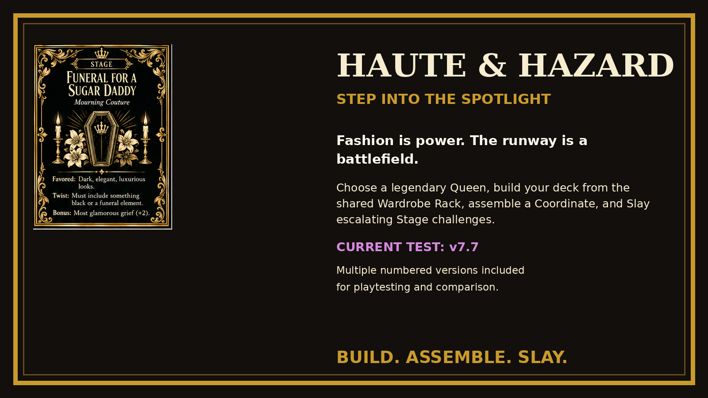
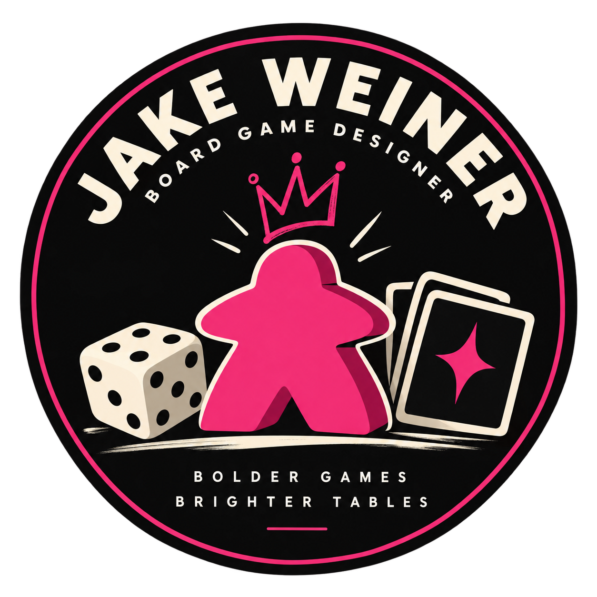

# Haute & Hazard: Step Into the Spotlight

Fashion is power. The runway is a battlefield. Welcome to **Haute & Hazard**, the competitive drag deck-building game where only the sharpest eye and the boldest look survive.

Choose your legendary Queen. Build your deck from the shared Wardrobe Rack. Pull wigs, makeup, gowns, shoes, and accessories together into a Coordinate that stops the show. Generate Tips to shop the Rack, build Appeal to Slay venue Stages, and bring your Lip Sync strength to the table when a Dragdagulan puts you head-to-head with a rival.

Every round is a choice. Serve a flawless Perfect Illusion. Turn thrift-store scraps into couture. Or sabotage the competition with a wardrobe malfunction timed just right. Earn Style Points. Survive the hazards. When the curtain falls, only one Queen truly slays.

**Build your deck. Assemble your look. Slay the Stage.**

## Current Game Crafter print edition: v7.8

The project retains multiple numbered versions for testing and comparison. Use files from the same version together; do not mix an older Stage deck, Queen set, Player Aid, or rulebook into a v7.8 Game Crafter game.

Version 7.8 preserves the core Tenet/Brand color system, the Tips/Shopping economy, Appeal/Matching/Perfect Illusion/Fusion, and Dragdagulan LS. It updates the physical print edition with:

- 12 venue-style Stage cards instead of challenge-name Stages;
- a balanced 3 Pink / 3 Blue / 3 Purple / 3 Yellow Stage mix covering every Base Game Brand;
- Judge, Spotlight, Judge's Favor, Featured Brand, and Brand Ovation on Stages;
- 12 Jumbo Queens, each with a Signature Ability and one once-per-game Special Appeal;
- updated Player Aids and Medium Folio rules;
- the existing 240-card Poker Deck kept separate from the foil Stage deck;
- updated Game Crafter upload specifications and QA documentation;
- a **Beginner Mode** that teaches the game using only Favored Tenet, Featured Brand, Slay Target, Reward, and Venue Effect on each Stage.

## Documentation

- [Publisher sell sheet](docs/PUBLISHER_SELL_SHEET.md) — one-page overview for publisher outreach, prototype status, core hook, and development goals.
- [Beginner Mode](docs/BEGINNER_MODE.md) — recommended first-game rules; ignores Judge, Spotlight Requirement, Judge's Favor, and Brand Ovation while keeping the rest of the game intact.
- [Current gameplay reference](docs/CURRENT_GAMEPLAY.md) — Coordinate, Tenets/Brands, turn structure, Shopping, Slay, Dragdagulan, and end game.
- [Starting decks](docs/STARTING_DECKS.md) — exact 12-card Dressing Room Floor deck, setup, card roles, deck growth, and sorting guidance.
- [Queen roster](docs/QUEEN_ROSTER.md) — all 12 Queens, Signature Abilities, and Special Appeals.
- [Current physical card pool](docs/CARD_POOL.md) — exact 240-card Poker Deck accounting and separate Stage/Queen components.
- [Feedback guide](docs/FEEDBACK.md) — quick feedback questions, 1–5 ratings, Beginner/Full Stage prompts, and detailed playtest guidance.
- [Designer branding](docs/BRANDING.md) — official Jake Weiner Board Game Designer logo and usage guidance.
- [Version history](docs/VERSION_HISTORY.md) — current, legacy, and retained test builds.
- [v7.8 Game Crafter upload guide](releases/v7.8/UPLOAD_GUIDE.md) — exact upload order, component folders, dimensions, and safe-zone notes.
- [v7.8 release status](releases/v7.8/RELEASE_STATUS.md) — QA status and binary-package availability.
- [v7.8 Stage venue list](releases/v7.8/STAGE_VENUE_LIST.md) — the current 12 venue Stages and their Tenet/Brand distribution.

## Download

| Package | Contents |
|---|---|
| [Game Crafter Print Edition v7.8](releases/v7.8/) | **Current** Game Crafter component manifest, upload guide, venue Stage list, Queen/gameplay references, QA report, and release notes |
| [Core Playtest Set v7.7](releases/v7.7/Haute_Hazard_v7.7_Core_Playtest_Set.zip) | Printable cards, replacement Stage cards, rulebook, Player Aid, card list, and testing documents |
| [Tabletop Simulator v7.7](releases/v7.7/Haute_Hazard_v7.7_TTS_Playtest.zip) | Full standard setup, Siren Diesel vs. Opal Dynasty teaching setup, local assets, and installer |
| [Promotional Kit v7.7](releases/v7.7/Haute_Hazard_v7.7_Promotional_Kit.zip) | Flyer, poster, social graphics, approved blurb, and social copy |
| [Game Crafter Prototype v7.7.1 — archived](releases/v7.7.1/) | **Legacy reference only.** Superseded by v7.8; retained for historical comparison and troubleshooting older proofs |

## Game Crafter physical build

The v7.8 print edition uses:

- **Rules** — 1 Medium Folio Set
- **Haute & Hazard** — 240-card Poker Deck
- **Stages** — 12-card Holographic Foil Euro Poker Deck
- **The Queens** — 12-card Jumbo Deck
- **Player Aid** — 5 double-sided Postcard Mats
- **Box** — 1 Medium Prototype Box

The 240-card Poker Deck consists of the 60 starter cards, 144-card Wardrobe Rack, 16 Thrift Store Throwbacks, and 20 Penalty cards. The Stage deck and Queens are separate physical decks/components.

Each player begins with the same **12-card Dressing Room Floor deck: 7 Basic Beat, 3 Messy Lip Sync, and 2 Chapstick**. See [Starting decks](docs/STARTING_DECKS.md) for setup and card roles.

## First game

For a first physical game, use **Beginner Mode**. Play the normal v7.8 game but read only these Stage fields: **Favored Tenet, Featured Brand, Slay Target, Reward, and Venue Effect**. Ignore **Judge, Spotlight Requirement, Judge's Favor, and Brand Ovation** until the next game. See [Beginner Mode](docs/BEGINNER_MODE.md).

For the existing v7.7 Tabletop Simulator teaching game, use **Siren Diesel** and **Opal Dynasty**. That teaching save includes both Queens, a fixed beginner Wardrobe Rack, and *Face Face Face* as the opening Active Stage. The TTS package remains on v7.7 until it receives its own v7.8 venue-Stage conversion.

For current physical production, follow `releases/v7.8/UPLOAD_GUIDE.md`, not the archived v7.7.1 Game Crafter instructions.

## Tabletop Simulator

Extract the entire TTS package, then follow its included `README.txt`. Windows users can run `INSTALL_WINDOWS.ps1`. The included saves use local assets; online multiplayer hosts should upload the assets through Tabletop Simulator's Cloud Manager before inviting remote testers.

## Feedback & playtesting

**Haute & Hazard is still in active prototype playtesting, and feedback is part of the design process.** You do not need to be an experienced game designer to help. First impressions, confusion, excitement, pacing problems, and unexpected strategies are all useful.

### What we want to know most

After a game, tell us:

- Which mode did you use: **Beginner Mode** or **Full Stage Rules**?
- How many players played, and how long did the game take?
- Which Queens were used?
- What was the **most fun** moment?
- What was the **most confusing** moment?
- Did Shopping and deck-building feel rewarding?
- Did assembling Complete, Matching, Perfect Illusion, and Fusion Looks feel understandable and satisfying?
- Did the Stage meaningfully affect your decisions?
- Did Dragdagulan feel worth attempting?
- Did any Queen, Brand, Tenet, Stage, card, or Special Appeal feel noticeably too strong or too weak?
- Did the game feel too short, too long, or about right?
- **Would you play again? Why or why not?**

For a more detailed questionnaire and 1–5 rating guide, see the **[Feedback Guide](docs/FEEDBACK.md)**.

### Submit a playtest report

Use the GitHub **[Playtest Report form](https://github.com/jbwncster/haute-and-hazard/issues/new?template=playtest-report.yml)** for a full session report.

A useful report includes the version and mode, player count, Queens, game length, winner/final scores, Stage results, Look states, Shopping choices, Dragdagulan results, penalties, Signature Ability/Special Appeal use, and any wording that required a table ruling.

The most useful balance feedback describes **what happened first** and suggests a fix second. For example, “this Queen gained 8 more SP than everyone else because this ability triggered four times” is more useful than simply saying “this Queen is overpowered.” Repeated patterns across multiple games are especially valuable.

If you only have a few minutes, even answers to **most fun / most confusing / would you play again?** are worth submitting.

## Publisher inquiries

**Haute & Hazard is available for publisher evaluation while it is still in active prototype development.** The core identity is established, but balance, pacing, component counts, wording, graphic design, and advanced systems remain open to collaborative development.

See the **[Publisher Sell Sheet](docs/PUBLISHER_SELL_SHEET.md)** for a concise overview. Rules, print-and-play materials, a physical Game Crafter prototype, component documentation, prototype photos, and playtest materials can be provided for review.

## Designer

  

**Jake Weiner — Board Game Designer**  
Official logo usage: [Designer Branding](docs/BRANDING.md)

## Development status

This is an unpublished playtest prototype. Card wording, balance, graphic design, and component counts may change between versions. v7.8 is the current Game Crafter production target; v7.7.1 is retained only as an archived reference.

## Rights

Copyright © 2026. All rights reserved. No license is granted for redistribution, commercial use, derivative works, or use of the game's visual assets beyond personal playtesting. The repository is public so invited testers can access and discuss the prototype.
